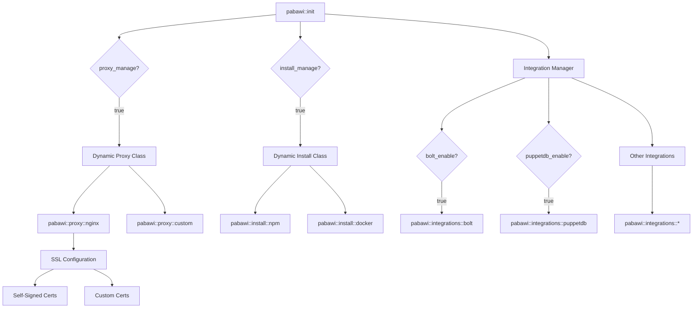
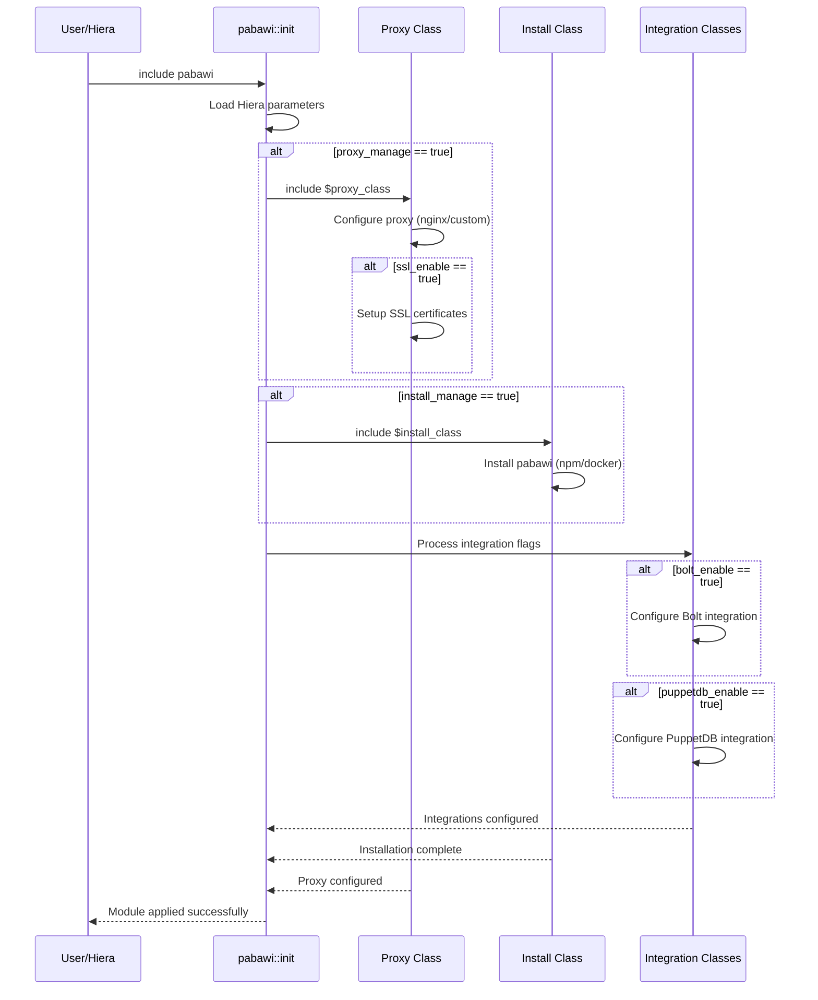
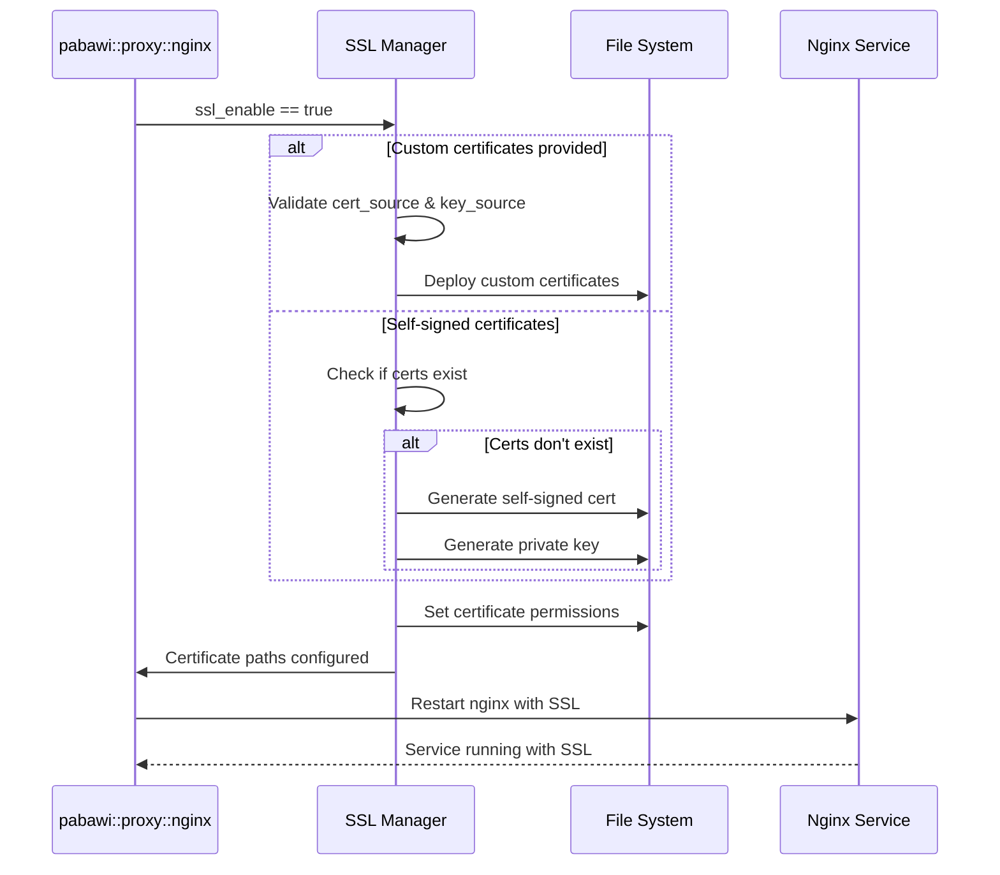

# Design Document: Puppet Pabawi Module

## Overview

This Puppet module provides a flexible, modular approach to installing and configuring the Pabawi application with support for multiple installation methods (npm, docker), proxy configurations (nginx with SSL), and various integrations (Bolt, PuppetDB, and extensible integration framework). The design emphasizes separation of concerns through a class-based architecture where each component (proxy, installation, integrations) can be independently enabled, disabled, or swapped with alternative implementations.

The module follows Puppet best practices with Hiera-driven configuration, allowing users to customize behavior through data rather than code modifications. The architecture supports extensibility for future integrations while maintaining backward compatibility and sensible defaults.

## Architecture



## Sequence Diagrams

### Module Initialization Flow



### SSL Certificate Setup Flow



## Components and Interfaces

### Component 1: Main Module Class (pabawi::init)

**Purpose**: Entry point for the module, orchestrates all subcomponents based on Hiera configuration

**Interface**:
```puppet
class pabawi (
  Boolean $proxy_manage = true,
  String $proxy_class = 'pabawi::proxy::nginx',
  Boolean $install_manage = true,
  String $install_class = 'pabawi::install::npm',
  Boolean $bolt_enable = false,
  Boolean $puppetdb_enable = false,
  Hash[String, Boolean] $integrations = {},
) {
  # Class implementation
}
```

**Responsibilities**:
- Load and validate Hiera configuration parameters
- Conditionally include proxy class based on proxy_manage flag
- Conditionally include installation class based on install_manage flag
- Iterate through integration flags and include appropriate integration classes
- Ensure proper ordering and dependencies between components

**Validation Rules**:
- proxy_class must be a valid Puppet class name
- install_class must be a valid Puppet class name
- Integration flags must be boolean values

### Component 2: Nginx Proxy Class (pabawi::proxy::nginx)

**Purpose**: Configure nginx as a reverse proxy for Pabawi with optional SSL support

**Interface**:
```puppet
class pabawi::proxy::nginx (
  Boolean $ssl_enable = true,
  Boolean $ssl_self_signed = true,
  Optional[String] $ssl_cert_source = undef,
  Optional[String] $ssl_key_source = undef,
  String $ssl_cert_path = '/etc/nginx/ssl/pabawi.crt',
  String $ssl_key_path = '/etc/nginx/ssl/pabawi.key',
  Integer $listen_port = 443,
  Integer $backend_port = 3000,
  String $server_name = $facts['fqdn'],
) {
  # Class implementation
}
```

**Responsibilities**:
- Install and configure nginx package
- Generate or deploy SSL certificates
- Create nginx virtual host configuration
- Manage nginx service state
- Configure reverse proxy rules to backend application

### Component 3: NPM Installation Class (pabawi::install::npm)

**Purpose**: Install Pabawi from source using npm

**Interface**:
```puppet
class pabawi::install::npm (
  String $install_dir = '/opt/pabawi',
  String $repo_url = 'https://github.com/example/pabawi.git',
  String $version = 'main',
  String $user = 'pabawi',
  String $group = 'pabawi',
  Hash $npm_config = {},
) {
  # Class implementation
}
```

**Responsibilities**:
- Create application user and group
- Install Node.js and npm dependencies
- Clone or update application repository
- Run npm install and build processes
- Configure systemd service for application
- Manage application service state

### Component 4: Docker Installation Class (pabawi::install::docker)

**Purpose**: Install Pabawi using Docker containers

**Interface**:
```puppet
class pabawi::install::docker (
  String $image = 'pabawi/pabawi:latest',
  String $container_name = 'pabawi',
  Hash $environment = {},
  Array[String] $volumes = [],
  Hash $ports = { '3000' => '3000' },
  Boolean $auto_restart = true,
) {
  # Class implementation
}
```

**Responsibilities**:
- Ensure Docker is installed and running
- Pull specified Pabawi Docker image
- Create and configure Docker container
- Manage container lifecycle
- Configure container networking and volumes

### Component 5: Bolt Integration Class (pabawi::integrations::bolt)

**Purpose**: Configure Pabawi integration with Puppet Bolt

**Interface**:
```puppet
class pabawi::integrations::bolt (
  String $project_path,
  Optional[String] $bolt_config_path = undef,
  Hash $bolt_settings = {},
) {
  # Class implementation
}
```

**Responsibilities**:
- Validate Bolt project path exists
- Configure Pabawi to connect to Bolt project
- Set up authentication and permissions
- Create integration configuration files

### Component 6: PuppetDB Integration Class (pabawi::integrations::puppetdb)

**Purpose**: Configure Pabawi integration with PuppetDB

**Interface**:
```puppet
class pabawi::integrations::puppetdb (
  String $server_url,
  Optional[String] $ssl_cert = undef,
  Optional[String] $ssl_key = undef,
  Optional[String] $ssl_ca = undef,
  Integer $timeout = 30,
) {
  # Class implementation
}
```

**Responsibilities**:
- Validate PuppetDB server URL
- Configure SSL certificates for PuppetDB connection
- Set up query timeout and connection parameters
- Create integration configuration files

## Data Models

### Model 1: Module Configuration

```puppet
type Pabawi::Config = Struct[{
  proxy_manage     => Boolean,
  proxy_class      => String[1],
  install_manage   => Boolean,
  install_class    => String[1],
  bolt_enable      => Boolean,
  puppetdb_enable  => Boolean,
  integrations     => Hash[String[1], Boolean],
}]
```

**Validation Rules**:
- All class names must be non-empty strings
- Boolean flags must be explicitly true or false
- Integration hash keys must be non-empty strings

### Model 2: SSL Configuration

```puppet
type Pabawi::SSL::Config = Struct[{
  enable           => Boolean,
  self_signed      => Boolean,
  cert_source      => Optional[String[1]],
  key_source       => Optional[String[1]],
  cert_path        => Stdlib::Absolutepath,
  key_path         => Stdlib::Absolutepath,
}]
```

**Validation Rules**:
- If self_signed is false, cert_source and key_source must be provided
- cert_path and key_path must be absolute filesystem paths
- Certificate files must be readable by nginx user

### Model 3: Integration Configuration

```puppet
type Pabawi::Integration::Config = Struct[{
  enabled          => Boolean,
  config_path      => Optional[Stdlib::Absolutepath],
  settings         => Hash[String, Data],
}]
```

**Validation Rules**:
- config_path must be absolute path if provided
- settings hash can contain any valid Puppet data types
- Integration-specific validation in respective classes

## Algorithmic Pseudocode

### Main Module Initialization Algorithm

```pascal
ALGORITHM initializePabawiModule(config)
INPUT: config of type Pabawi::Config
OUTPUT: configured system state

BEGIN
  ASSERT config is valid Pabawi::Config
  
  // Step 1: Validate configuration
  validateConfiguration(config)
  
  // Step 2: Setup proxy if managed
  IF config.proxy_manage = true THEN
    ASSERT isValidClassName(config.proxy_class)
    includeClass(config.proxy_class)
  END IF
  
  // Step 3: Setup installation if managed
  IF config.install_manage = true THEN
    ASSERT isValidClassName(config.install_class)
    
    // Ensure proxy is configured before installation
    IF config.proxy_manage = true THEN
      REQUIRE proxyClass BEFORE installClass
    END IF
    
    includeClass(config.install_class)
  END IF
  
  // Step 4: Process integrations
  processIntegrations(config)
  
  ASSERT allComponentsConfigured()
  
  RETURN success
END

ALGORITHM processIntegrations(config)
INPUT: config of type Pabawi::Config
OUTPUT: configured integrations

BEGIN
  // Process built-in integrations
  IF config.bolt_enable = true THEN
    ASSERT config.bolt_project_path is defined
    includeClass('pabawi::integrations::bolt')
  END IF
  
  IF config.puppetdb_enable = true THEN
    ASSERT config.puppetdb_server_url is defined
    includeClass('pabawi::integrations::puppetdb')
  END IF
  
  // Process custom integrations from hash
  FOR each (name, enabled) IN config.integrations DO
    ASSERT enabled is Boolean
    
    IF enabled = true THEN
      integrationClass ← "pabawi::integrations::" + name
      
      IF classExists(integrationClass) THEN
        includeClass(integrationClass)
      ELSE
        logWarning("Integration class not found: " + integrationClass)
      END IF
    END IF
  END FOR
  
  RETURN success
END
```

**Preconditions**:
- Puppet agent is running with appropriate permissions
- Hiera data is accessible and properly formatted
- Required Puppet modules are installed (stdlib, etc.)

**Postconditions**:
- All enabled components are configured
- Service dependencies are properly ordered
- Configuration files are created with correct permissions
- Services are running if installation was managed

**Loop Invariants**:
- All previously processed integrations are properly configured
- Configuration state remains consistent throughout iteration

### SSL Certificate Management Algorithm

```pascal
ALGORITHM setupSSLCertificates(sslConfig)
INPUT: sslConfig of type Pabawi::SSL::Config
OUTPUT: configured SSL certificates

BEGIN
  ASSERT sslConfig.enable = true
  
  // Step 1: Ensure SSL directory exists
  sslDir ← dirname(sslConfig.cert_path)
  ensureDirectory(sslDir, mode: '0755', owner: 'root')
  
  // Step 2: Deploy or generate certificates
  IF sslConfig.self_signed = false THEN
    // Custom certificates provided
    ASSERT sslConfig.cert_source is defined
    ASSERT sslConfig.key_source is defined
    
    deployFile(
      source: sslConfig.cert_source,
      destination: sslConfig.cert_path,
      mode: '0644',
      owner: 'root'
    )
    
    deployFile(
      source: sslConfig.key_source,
      destination: sslConfig.key_path,
      mode: '0600',
      owner: 'root'
    )
  ELSE
    // Generate self-signed certificate
    IF NOT fileExists(sslConfig.cert_path) OR 
       NOT fileExists(sslConfig.key_path) THEN
      
      generateSelfSignedCert(
        certPath: sslConfig.cert_path,
        keyPath: sslConfig.key_path,
        commonName: facts['fqdn'],
        validDays: 365
      )
      
      setFilePermissions(sslConfig.cert_path, '0644', 'root', 'root')
      setFilePermissions(sslConfig.key_path, '0600', 'root', 'root')
    END IF
  END IF
  
  // Step 3: Validate certificates
  ASSERT fileExists(sslConfig.cert_path)
  ASSERT fileExists(sslConfig.key_path)
  ASSERT validateCertificate(sslConfig.cert_path, sslConfig.key_path)
  
  RETURN success
END
```

**Preconditions**:
- SSL is enabled in configuration
- If custom certs: cert_source and key_source are valid file sources
- OpenSSL is installed for self-signed certificate generation
- Target directory is writable

**Postconditions**:
- Certificate file exists at cert_path with mode 0644
- Private key exists at key_path with mode 0600
- Certificate and key are valid and match
- Files are owned by root user

**Loop Invariants**: N/A (no loops in this algorithm)

### NPM Installation Algorithm

```pascal
ALGORITHM installPabawiNPM(installConfig)
INPUT: installConfig containing install_dir, repo_url, version, user, group
OUTPUT: installed and running Pabawi application

BEGIN
  ASSERT installConfig is valid
  
  // Step 1: Setup user and directory
  ensureUser(installConfig.user, group: installConfig.group)
  ensureDirectory(
    installConfig.install_dir,
    owner: installConfig.user,
    group: installConfig.group,
    mode: '0755'
  )
  
  // Step 2: Install Node.js and npm
  ensurePackage('nodejs')
  ensurePackage('npm')
  
  // Step 3: Clone or update repository
  IF directoryExists(installConfig.install_dir + '/.git') THEN
    gitPull(
      directory: installConfig.install_dir,
      branch: installConfig.version,
      user: installConfig.user
    )
  ELSE
    gitClone(
      url: installConfig.repo_url,
      destination: installConfig.install_dir,
      branch: installConfig.version,
      user: installConfig.user
    )
  END IF
  
  // Step 4: Install npm dependencies
  npmInstall(
    directory: installConfig.install_dir,
    user: installConfig.user,
    config: installConfig.npm_config
  )
  
  // Step 5: Build application
  npmRun(
    command: 'build',
    directory: installConfig.install_dir,
    user: installConfig.user
  )
  
  // Step 6: Setup systemd service
  createSystemdService(
    name: 'pabawi',
    execStart: installConfig.install_dir + '/bin/pabawi',
    user: installConfig.user,
    workingDirectory: installConfig.install_dir
  )
  
  // Step 7: Start and enable service
  ensureService('pabawi', ensure: 'running', enable: true)
  
  ASSERT serviceIsRunning('pabawi')
  
  RETURN success
END
```

**Preconditions**:
- Git is installed on the system
- Network access to repository URL
- Sufficient disk space in install_dir
- User has permissions to create users and services

**Postconditions**:
- Application user and group exist
- Repository is cloned at install_dir
- npm dependencies are installed
- Application is built successfully
- Systemd service is created, enabled, and running
- Application is accessible on configured port

**Loop Invariants**: N/A (no explicit loops, though npm install iterates internally)

## Key Functions with Formal Specifications

### Function 1: validateConfiguration()

```puppet
function pabawi::validate_configuration(Pabawi::Config $config) >> Boolean {
  # Implementation
}
```

**Preconditions**:
- $config parameter is provided
- $config conforms to Pabawi::Config type

**Postconditions**:
- Returns true if configuration is valid
- Returns false or raises error if configuration is invalid
- No side effects on input parameter

**Loop Invariants**: N/A

### Function 2: includeClass()

```puppet
define pabawi::include_class(String $class_name) {
  # Implementation using include or contain
}
```

**Preconditions**:
- $class_name is a non-empty string
- $class_name represents a valid Puppet class

**Postconditions**:
- Specified class is included in catalog
- Class parameters are loaded from Hiera
- Class dependencies are resolved

**Loop Invariants**: N/A

### Function 3: ensureDirectory()

```puppet
define pabawi::ensure_directory(
  Stdlib::Absolutepath $path,
  String $owner,
  String $group,
  String $mode,
) {
  # Implementation using file resource
}
```

**Preconditions**:
- $path is an absolute filesystem path
- $owner and $group are valid system users/groups
- $mode is a valid octal permission string

**Postconditions**:
- Directory exists at $path
- Directory has specified owner, group, and permissions
- Parent directories are created if needed

**Loop Invariants**: N/A

## Example Usage

### Example 1: Basic Installation with Nginx Proxy

```puppet
# In Hiera (common.yaml)
---
pabawi::proxy_manage: true
pabawi::proxy_class: 'pabawi::proxy::nginx'
pabawi::install_manage: true
pabawi::install_class: 'pabawi::install::npm'

# In manifest
include pabawi
```

### Example 2: Docker Installation with Custom SSL

```puppet
# In Hiera
---
pabawi::proxy_manage: true
pabawi::proxy_class: 'pabawi::proxy::nginx'
pabawi::proxy::nginx::ssl_enable: true
pabawi::proxy::nginx::ssl_self_signed: false
pabawi::proxy::nginx::ssl_cert_source: 'puppet:///modules/site/ssl/pabawi.crt'
pabawi::proxy::nginx::ssl_key_source: 'puppet:///modules/site/ssl/pabawi.key'

pabawi::install_manage: true
pabawi::install_class: 'pabawi::install::docker'
pabawi::install::docker::image: 'pabawi/pabawi:v1.2.3'

# In manifest
include pabawi
```

### Example 3: Full Integration Setup

```puppet
# In Hiera
---
pabawi::proxy_manage: true
pabawi::install_manage: true

pabawi::bolt_enable: true
pabawi::bolt_project_path: '/opt/bolt-project'

pabawi::puppetdb_enable: true
pabawi::puppetdb_server_url: 'https://puppetdb.example.com:8081'

pabawi::integrations:
  terraform: true
  ansible: true
  custom_integration: true

# In manifest
include pabawi
```

### Example 4: Minimal Installation (No Proxy)

```puppet
# In Hiera
---
pabawi::proxy_manage: false
pabawi::install_manage: true
pabawi::install_class: 'pabawi::install::npm'

# In manifest
include pabawi
```

## Correctness Properties

### Property 1: Component Independence
```puppet
# For all configurations where proxy_manage = false
# The installation must succeed without proxy configuration
∀ config ∈ Pabawi::Config:
  config.proxy_manage = false ⟹
    canInstallWithout(proxy) ∧ applicationRuns()
```

### Property 2: SSL Certificate Validity
```puppet
# When SSL is enabled, certificates must always be valid
∀ sslConfig ∈ Pabawi::SSL::Config:
  sslConfig.enable = true ⟹
    (fileExists(sslConfig.cert_path) ∧
     fileExists(sslConfig.key_path) ∧
     certificateMatchesKey(sslConfig.cert_path, sslConfig.key_path))
```

### Property 3: Integration Idempotency
```puppet
# Applying the module multiple times produces the same result
∀ config ∈ Pabawi::Config:
  apply(config) = state₁ ∧
  apply(config) = state₂ ⟹
    state₁ = state₂
```

### Property 4: Service Dependency Ordering
```puppet
# Installation must complete before service starts
∀ installConfig:
  installComplete(installConfig) ⟹
    serviceCanStart('pabawi')
```

### Property 5: Integration Configuration Consistency
```puppet
# Enabled integrations must have required parameters
∀ integration ∈ enabledIntegrations:
  integration.enabled = true ⟹
    hasRequiredParameters(integration)
```

## Error Handling

### Error Scenario 1: Invalid Proxy Class

**Condition**: User specifies a proxy_class that doesn't exist
**Response**: Puppet catalog compilation fails with descriptive error message
**Recovery**: User corrects proxy_class in Hiera to valid class name

### Error Scenario 2: Missing SSL Certificate Source

**Condition**: ssl_self_signed = false but cert_source or key_source not provided
**Response**: Validation fails during catalog compilation
**Recovery**: User provides valid certificate sources or enables self-signed certificates

### Error Scenario 3: Repository Clone Failure

**Condition**: Git repository URL is unreachable or invalid
**Response**: Installation fails with network error, service not started
**Recovery**: Check network connectivity, verify repository URL, retry Puppet run

### Error Scenario 4: NPM Install Failure

**Condition**: npm install fails due to dependency conflicts or network issues
**Response**: Installation fails, error logged, service not started
**Recovery**: Review npm error logs, resolve dependency issues, retry

### Error Scenario 5: Integration Missing Required Parameters

**Condition**: Integration enabled but required parameters (e.g., bolt_project_path) not provided
**Response**: Validation fails with specific parameter requirement message
**Recovery**: User provides required parameters in Hiera configuration

### Error Scenario 6: Port Conflict

**Condition**: Configured port already in use by another service
**Response**: Service fails to start, error logged
**Recovery**: Change port configuration or stop conflicting service

## Testing Strategy

### Unit Testing Approach

Use rspec-puppet for unit testing individual classes and defined types:

- Test parameter validation for all classes
- Test conditional logic (proxy_manage, install_manage flags)
- Test resource creation (files, services, packages)
- Test class relationships and dependencies
- Mock external dependencies (package managers, git)
- Achieve >90% code coverage

**Key Test Cases**:
- Default parameters produce valid configuration
- Custom parameters override defaults correctly
- Invalid parameters trigger appropriate errors
- Conditional resources are created only when enabled
- Resource ordering is correct (proxy before install, etc.)

### Property-Based Testing Approach

**Property Test Library**: rspec-puppet with custom property generators

**Properties to Test**:
1. **Idempotency**: Running Puppet twice with same config produces identical catalogs
2. **Parameter Validation**: All invalid parameter combinations are rejected
3. **Resource Ordering**: Dependencies are always satisfied before dependents
4. **File Permissions**: All created files have secure permissions
5. **Service State**: Enabled services are always running after successful apply

**Test Data Generation**:
- Generate random valid configurations
- Generate random invalid configurations (boundary testing)
- Generate edge cases (empty strings, nil values, extreme numbers)

### Integration Testing Approach

Use Beaker or Kitchen-Puppet for integration testing on real VMs:

- Test full module application on clean systems
- Test upgrades from previous versions
- Test different OS distributions (Ubuntu, CentOS, Debian)
- Test interaction between components (proxy + npm install)
- Test all integration combinations
- Verify services are actually running and accessible
- Test SSL certificate generation and deployment
- Test Docker container lifecycle

**Test Scenarios**:
- Fresh installation with default settings
- Installation with custom SSL certificates
- Docker-based installation
- All integrations enabled simultaneously
- Upgrade from npm to docker installation
- Proxy configuration changes
- Service restart and recovery

## Performance Considerations

- **Catalog Compilation**: Keep Hiera lookups minimal, cache computed values
- **Git Operations**: Use shallow clones for faster repository downloads
- **NPM Install**: Consider using npm ci for faster, reproducible installs
- **Docker Pulls**: Cache Docker images, use specific tags to avoid unnecessary pulls
- **SSL Generation**: Self-signed certificate generation is fast, but cache certificates
- **Service Restarts**: Only restart services when configuration actually changes
- **Parallel Execution**: Puppet handles parallelization, ensure no unnecessary serialization

**Optimization Strategies**:
- Use `unless` parameter on exec resources to avoid unnecessary runs
- Implement proper change detection for git repositories
- Use file checksums to detect configuration changes
- Minimize file resource refreshes

## Security Considerations

- **SSL Certificates**: Private keys must have mode 0600, owned by root
- **Self-Signed Certificates**: Warn users about security implications in production
- **Service User**: Run application as non-root user with minimal privileges
- **File Permissions**: Ensure configuration files are not world-readable
- **Secrets Management**: Never store passwords or API keys in Hiera (use eyaml or Vault)
- **Integration Credentials**: Use secure credential storage for PuppetDB, Bolt connections
- **Docker Security**: Run containers with security options, avoid privileged mode
- **Network Exposure**: Proxy should be the only public-facing component
- **Input Validation**: Validate all user-provided parameters to prevent injection attacks

**Security Best Practices**:
- Use TLS for all integration connections
- Implement certificate validation for external services
- Regular security updates for dependencies
- Audit logging for configuration changes
- Principle of least privilege for all service accounts

## Dependencies

**Puppet Modules**:
- puppetlabs/stdlib (>= 6.0.0) - Standard library functions and types
- puppetlabs/concat (>= 6.0.0) - For building configuration files
- puppet/nginx (>= 3.0.0) - Nginx management
- puppetlabs/docker (>= 4.0.0) - Docker management (optional)
- puppetlabs/vcsrepo (>= 5.0.0) - Git repository management

**System Packages**:
- nginx (for proxy functionality)
- nodejs and npm (for npm installation method)
- docker and docker-compose (for docker installation method)
- git (for source installation)
- openssl (for SSL certificate generation)

**External Services**:
- Git repository hosting (GitHub, GitLab, etc.)
- Docker registry (for docker installation method)
- PuppetDB server (if integration enabled)
- Bolt project (if integration enabled)

**Puppet Version**: >= 6.0.0 (for modern type system and features)
